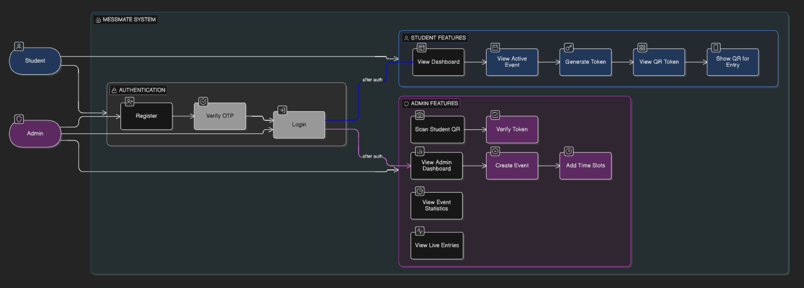
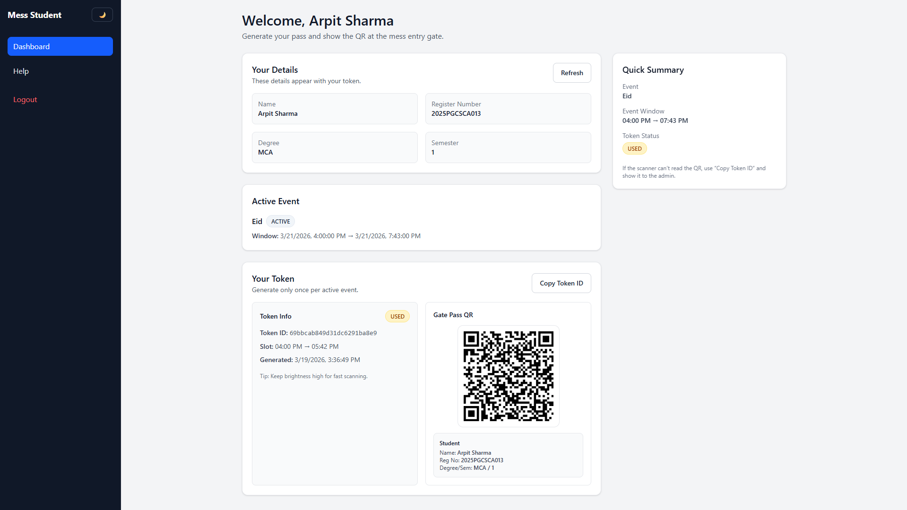
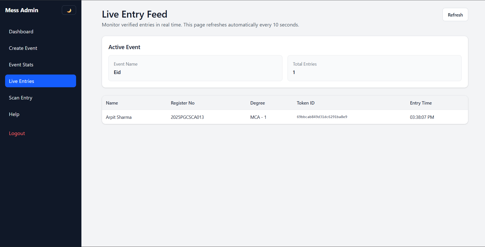
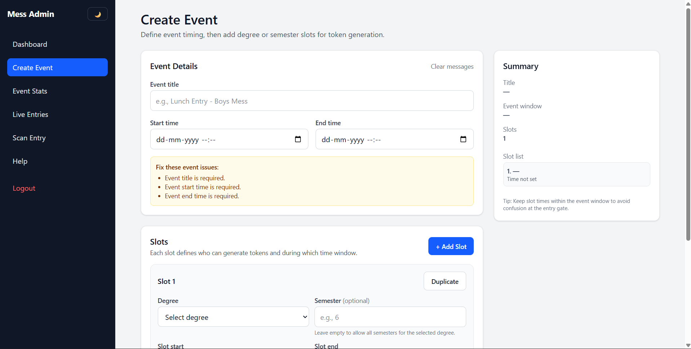
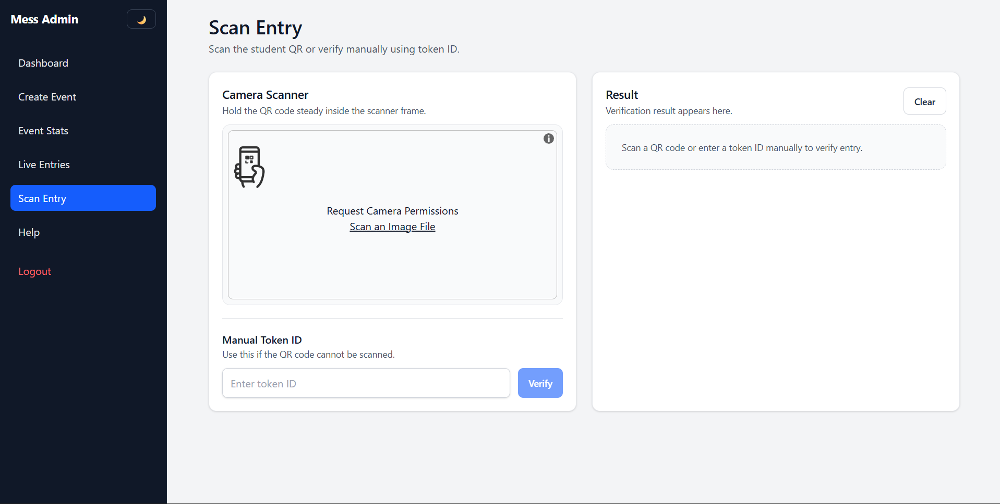

# 🍽️ MessMate – Smart Mess Entry Management System

MessMate is a QR-based token system for managing mess entry efficiently.  
It eliminates manual verification and enables fast, secure, and trackable access.

---

## 🚀 Features

- 🔐 Authentication with OTP
- 🎟️ QR-based token generation
- 📷 QR scanning at gate
- ⛔ Prevent duplicate entries
- 📊 Admin dashboard with stats
- 📡 Live entry tracking

👉 Full details: [Features](docs/FEATURES.md)

---

## 👥 User Roles

### Student
- Register & Login
- Generate Token
- Show QR for entry

### Admin
- Create Event
- Scan & Verify Entry
- View Stats & Live Entries

---

## 🏗️ System Overview

MessMate follows a client-server architecture:

Frontend (React) → Backend (Node/Express) → Database (MongoDB)

👉 Full architecture: [Architecture](docs/ARCHITECTURE.md)

---

## 📊 Diagrams

- Use Case Diagram
- System Architecture
- ER Diagram
- Sequence Diagrams

👉 View all diagrams: [Diagrams](docs/DIAGRAMS.md)

---

## 🔌 API Documentation

👉 View API endpoints: [API Docs](docs/API.md)

---

## 🖼️ Screenshots

---

