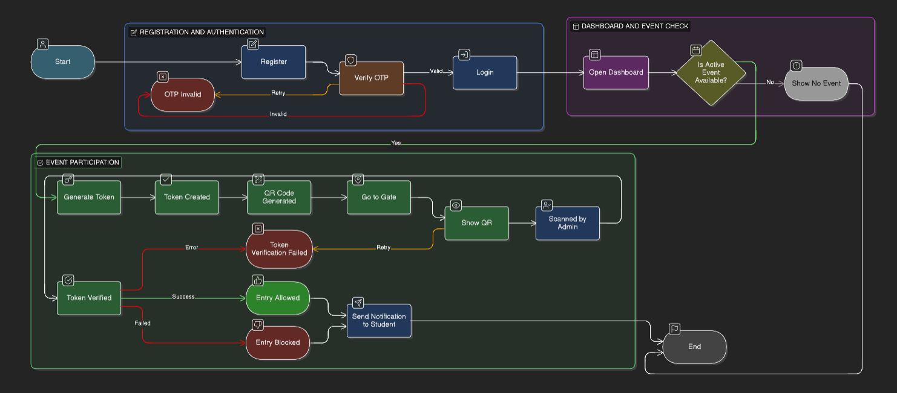
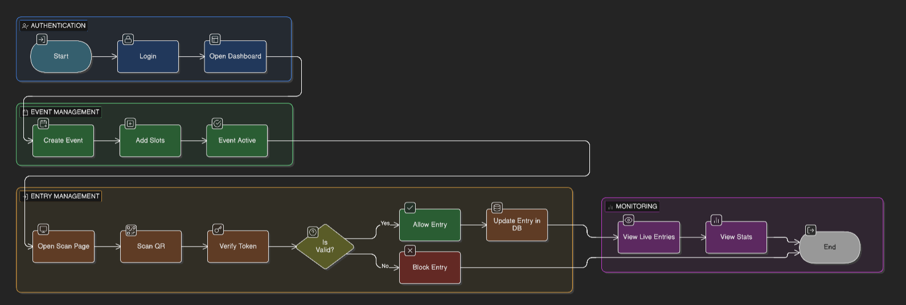
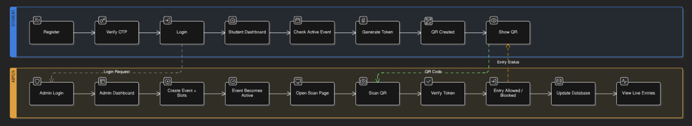
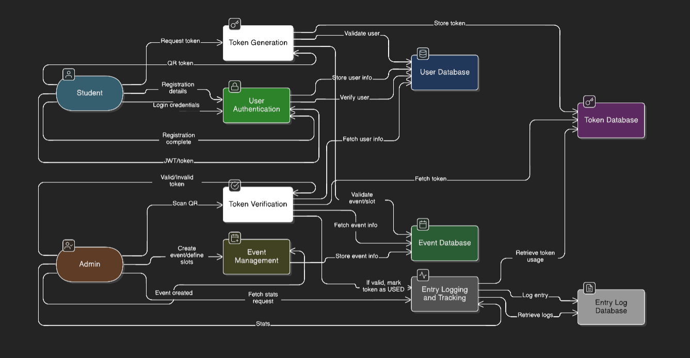
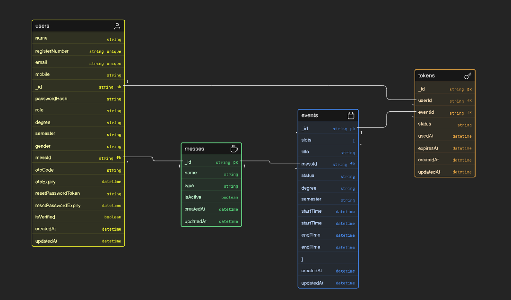

## 1. Use Case Diagram

The Use Case Diagram for MessMate represents the interaction between two primary actors: **Student** and **Admin**.

### Student Use Cases
- Register
- Verify OTP
- Login
- View Dashboard
- View Active Event
- Generate Token
- View QR Token
- Show QR for Entry

### Admin Use Cases
- Login
- Create Event
- Add Time Slots
- View Dashboard
- Scan Student QR
- Verify Token
- View Event Statistics
- View Live Entries

### Relationships
- Create Event includes Add Time Slots
- Generate Token includes View Active Event
- Scan Student QR includes Verify Token

## 2. User Flow Diagram
### Student Flow

###  Admin Flow

### Combined Flow

## 3. Data Flow Diagram

## 4. ER Diagram
